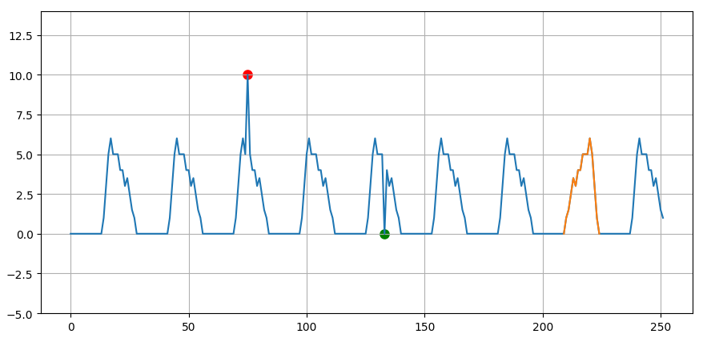
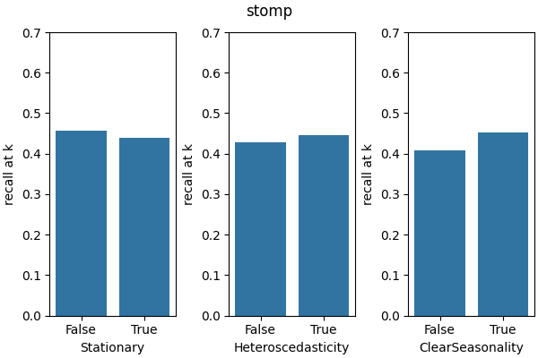
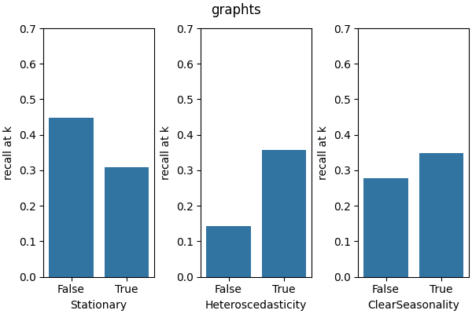
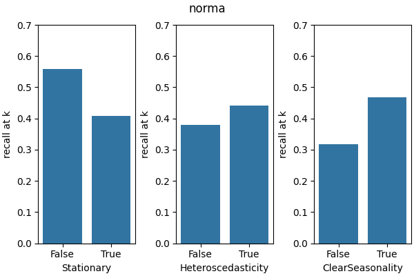
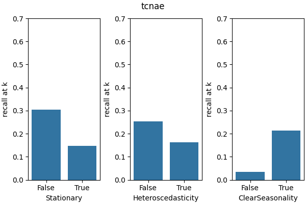
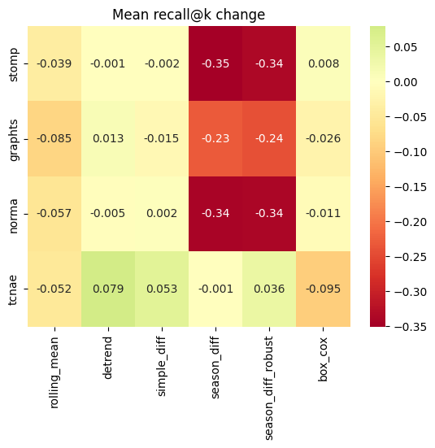
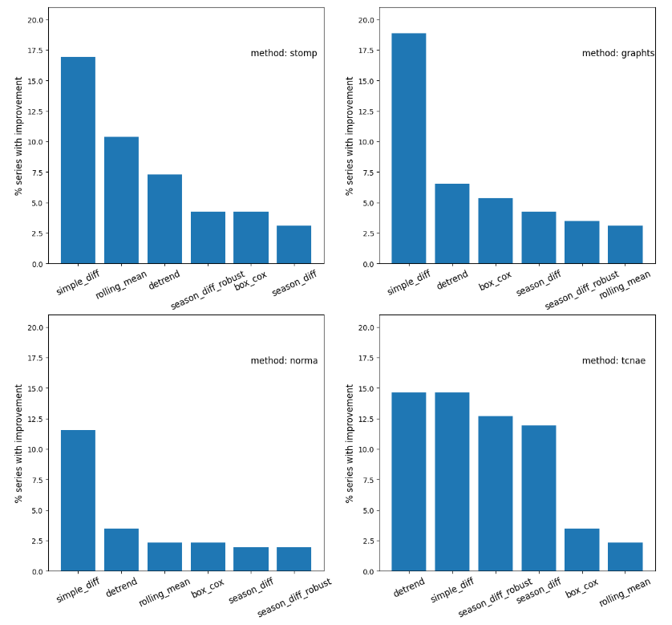

# Anomaly detection in non stationary time series
Anomaly detection in non-stationary time series - framework + experiment

---

## About the project

This repository contains the code for conducting experiments checking how time series anomaly detection
methods deal non-stationary time series data and whether transformations known from time series literature can
improve the detection performance. The project is focused on subsequence anomaly detection methods
(i.e. detecting anomalous fragments of time series, not just single points; see figure 1.).

This is the copy of my private repository where the project was developed. The private repository contained
some code I obtained from anomaly detection methods' authors, and I was not allowed to publish it.

The repository provides the following utilities:

- scripts for running the multistage experimental pipeline, including data preprocessing, time series characteristics
determining, various transformations, anomaly detection and evaluation
- a Python framework, on which the experiment-running scripts are based
- implementation of a custom deep learning-based anomaly detection method, based on the TCNAE [10]
(for other methods, third-party implementations have been used)

The project was used to conduct my master thesis experiment (and was also developed later).


Figure 1: Types of time series anomalies. The red point and the green point
are point anomalies, and the orange fragment is a subsequence anomaly.

## The experiment

This section provides a brief explanation of the goal of the experiment, anomaly detection methods, data,
transformations and results.

### Research questions

The goal of the experiment is to answer the following research questions:

- is anomaly detection performance of considered methods significantly different on time series exhibiting
various forms of non-stationarity (e.g. trend, seasonality)?
- does transforming a series with a transformation mitigating the non-stationarity (like detrending, differencing)
significantly improve the methods' performance?

### Anomaly detection methods

Four anomaly detection methods were tested:

- **STOMP** [8] - computing the matrix profile and an efficient way and finding time series discords
(subsequences with the largest distance to their nearest neighbor)
- **GraphTS** [9] - modeling time series subsequences as paths is a graph, with weights indicating their
probabilities 
- **NormA** [7], [13] - clustering time series subsequences and computing weighted distances to clusters
- **TCNAE** - a custom method based on TCNAE from [10], training two deep autoencoders based on the TCN
architecture and analyzing the reconstruction error

For the STOMP method, implementation from the _stumpy_ library has been used. For GraphTS and NormA methods,
I used the implementation obtained from the methods' authors, and the code was confidential; therefore, this repository
does not contain these methods' implementation. The TCNAE method was implemented by me.

Note that all tested methods are _unsupervised_, i.e. they work directly on the test dataset, assuming that the number
of anomalies is considerably lower than the number of normal samples, with no prior/trained knowledge about any of
the classes (normal or anomalous).

### Time series data

250 time series were involved in the experiment, coming from 4 publicly available sources:

- **UCR Time Series Anomaly Datasets** [3] - set of benchmark time series datasets from various domains,
with natural and synthetic anomalies
- **MIT-BIH Arrhythmia Database** [4], [5] - set of electrocardiogram recordings with annotated arrhythmias
(heart work anomalies)
- **MIT-BIH Supraventricular Arrhythmia Database** [4], [6] - set of electrocardiograms
recordings to supplement the examples of supraventricular arrhythmias in the MIT-BIH Arrhythmia Database
- **Sinus-Random-Walk** [7] (referred to as **SRW**) - synthetic benchmark for subsequence anomaly
detection

### Experimental procedure

The experiment consisted of four steps:

1. time series characteristics determining
2. measuring anomaly detection performance on original time series
3. measuring anomaly detection performance on transformed time series
4. measuring anomaly detection performance on time series with added trend

The purpose of the first step was to assign for each time series used in experiments
a set of non-stationarity types the series exhibits and gather some information
about its dynamics. We conducted three statistical tests on each series, which are commonly used in the literature:
the Augmented Dickey-Fuller test (ADF; used to check if a time series is stationary,
tests the null hypothesis that a unit root is present in the series), the Kwiatkowski-Phillips-Schmidt-Shin test
(KPSS; another statistical test to check whether a time series is stationary) and
the Goldfeld-Quandt test (checks whether a series exhibits heteroscedasticity)
For the purpose of checking whether seasonality is present in each series and the period length estimation,
we utilized the empirical autocorrelation function (ACF), with rough detrending with windowed
LOWESS (Locally Weighted Scatterplot Smoothing).

In the step 2., each anomaly detection method was applied to detect anomalies in each
time series from the time series experimental set. For each method and for
each time series a dedicated instance of the model was trained. All tested methods were unsupervised -
during training, the model obtained the entire time series and no ground truth labels.

In the step 3. the same anomaly detection procedure as in the step 2. was conducted but on transformed series.
We used 6 transformations:

- **rolling mean**: new series value is obtained as the arithmetic mean of the window of $l$ contiguous values;
kind of low-pass filter applied on time series values, reduces noise
- **detrending** - generally, detrending removes the trend component from time series; in this work,
we used the windowed LOWESS
- **simple differencing**: can remove deterministic or stochastic trend
- **seasonal differencing**: removes the seasonal pattern from series
- **robust seasonal differencing** - a custom modification of the seasonal differencing
- **box-cox transformation** - it aims at reducing the heteroscedasticity in the series; can only be applied to time
series with positive values, so if there are any negative values in the series, we shift all series values so that all
values are positive.

In the step 4., anomaly detection procedure is repeated once again, but deterministic
trend is added to input series.

The evaluation of methods was conducted by requesting the trained model to return $k$ most anomalous non-overlapping
subsequences, where $k$ is the true number of anomalous subsequences in the series, and check if there are consistent
with ground truth. This setup allows to isolate the problem of finding the most abnormal subsequences in the series
from two other distinct problems: determining the anomaly length and choosing the right number of anomalies
(e.g. estimation of anomaly score threshold). We used the recall@k metric to evaluate the methods' performance
(_k_ is always equal to the number of anomalies in a time series).

### Results

#### Original time series only

|              | UCR      | MIT-BIH Arrhythmia | MIT-BIH Supr. Arrhythmia | SRW      |
|--------------|----------|--------------------|--------------------------|----------|
| **random**   | 0.01     | 0.03               | 0.07                     | 0.14     |
| **STOMP**    | **0.43** | 0.33               | 0.48                     | 0.62     |
| **GraphTS**  | 0.30     | 0.21               | **0.56**                 | 0.95     |
| **NormA**    | 0.40     | 0.25               | 0.50                     | **0.97** |
| **TCNAE**    | 0.14     | **0.41**           | 0.54                     | 0.81     |
Table 1: Recall@k on original time series - mean per (method, series set) combination





Figure 2: Mean recall@k for each method on time series grouped by results from characteristics determining step

Table 1 shows mean recall@k for anomaly detection methods on untransformed time series sets. What is interesting is
that on each time series set (i.e. series from one source), a different method achieved the best result.

Figure 2 shows comparison of recall@k averaged on groups of time series with different characteristics determined.
The result indicates that the fact that a time series is non-stationary does not have to imply worse anomaly
detection performance.

#### Original vs transformed time series


Figure 3: Heatmap illustrating mean recall@k change after transformation, for each method and transformation


Figure 4: Percentage of transformed series with a statistically significant improvements in anomaly
detection after transformation

In Figure 5, mean change of recall@k is reported for each combination (method, transformation). First of all,
most of the positive changes is reported for the method TCNAE; for the other methods, detection on transformed time
series typically yielded very similar or worse results. An exception is detrending for GraphTS, which resulted in
over 1 p.p. improvement. Generally, detrending seems to be the safest and the most beneficial transformation.
For TCNAE, also simple differencing obtained a significantly positive result. Seasonal differencing typically
caused the significant drop in the detection quality but, what is particularly interesting, our custom version
of seasonal differencing obtained positive result for TCNAE, which contrasts with the results for other methods.

Another analysis of results on transformed time series has been conducted, which brings another perspective.
For each time series, counts of detected and not detected anomalies have been passed to the Barnard exact test,
which is a statistical test for comparing probabilities in two binomial experiments. It turns out that
each transformation improved the anomaly detection for each method on some time series. Particularly, simple
differencing yielded significantly better results very often - for GraphTS, it yielded a significant improvement for
about 18 % of time series.

#### Original time series vs time series with trend added

|             | UCR  | MIT-BIH Arrhythmia | MIT-BIH Supr. Arrhythmia |
|-------------|------|--------------------|--------------------------|
| **random**  | 0.01 | 0.02               | 0.07                     |
| **STOMP**   | 0.44 | 0.33               | 0.48                     |
| **GraphTS** | 0.29 | 0.21               | 0.56                     |
| **NormA**   | 0.37 | 0.23               | 0.51                     |
| **TCNAE**   | 0.02 | 0.40               | 0.48                     |
Table 2: Recall@k on time series with added trend - mean per (method, series set) combination

Table 2 reports mean recall@k achieved by methods on series sets with a random linear trend added.
We did not create the SRW version with trend added, as the series from this set already exhibit strong stochastic
trend. It can be seen that performance of the methods: STOMP, GraphTS and NormA did not change significantly.
On the other hand, TCNAE performance was severely affected.

### How to reproduce

**NOTE:** This repository does not contain the implementation of GraphTS and NormA methods as they cannot be
redistributed. In order to fully reproduce the experiment, contact the methods' authors.

1. Download raw data from the web sources:

```bash
cd scripts
./download_ucr.sh
./download_mitbih_arrhythmia.sh
./download_mitbih_supra.sh
./download_srw.sh
cd ..
```

2. Extract data from files into series sets:

```bash
PYTHONPATH=$(pwd)/src python3 scripts/load_series_sets.py
```

3. Determine features describing time series:

```bash
PYTHONPATH=$(pwd)/src python3 scripts/describe_series.py
```

4. Transform series:

```bash
PYTHONPATH=$(pwd)/src python3 scripts/transform_series.py
```

5. Run anomaly detection:

(Run for each transform, including `no_transformation`;
set the transform in `params.yaml`)

```bash
for I in $(seq 1 10)
do
  echo $I
  PYTHONPATH=$(pwd)/src python3 scripts/detect_anomalies.py
done
```

6. Compute metrics using utilities from `src/evaluation.py`


## The framework

```
.
├── data
│  ├── raw
│  └── series_sets
│
├── methods_params.yaml
├── params.yaml
├── requirements.txt
│
├── results
│  ├── describe_series
│  ├── detect_anomalies
│  ├── evaluation
│  └── visualize_anoms
│
├── scripts
│  ├── describe_series.py
│  ├── detect_anomalies.py
│  ├── download_mitbih_arrhythmia.sh
│  ├── download_mitbih_supra.sh
│  ├── download_srw.sh
│  ├── download_ucr.sh
│  ├── load_series_sets.py
│  ├── print_methods_params_as_latex.py
│  ├── transform_series.py
│  └── visualize_anoms.py
│
├── src
│  ├── base.py
│  ├── data_loading.py
│  ├── descriptors
│  │  ├── basic.py
│  │  ├── __init__.py
│  │  ├── multi_window_finder.py
│  │  ├── nonstationarity.py
│  │  ├── seasonality.py
│  │  └── window_size.py
│  ├── detection_utils.py
│  ├── detectors
│  │  ├── baseline.py
│  │  ├── classical.py
│  │  ├── deep.py
│  │  ├── __init__.py
│  │  └── tcn_ae.py
│  ├── evaluation.py
│  ├── params.py
│  ├── raw_data_loading.py
│  ├── results_utils.py
│  ├── transform
│  │  ├── __init__.py
│  │  ├── nonstat_addition.py
│  │  └── nonstat_removal.py
│  ├── tuning_utils.py
│  ├── utils.py
│  └── visualization.py
│
└── tests
    ├── test_adjust_anoms.py
    ├── test_anoms_df_to_tuples.py
    ├── test_evaluation.py
    ├── test_raw_data_loading.py
    └── test_tuning.py
```

The `src` directory contains the package with utilities for experiments with time series and anomaly
detection. Key design principles:
- `base.py` provides the base classes defining the problem domain and implementing the fundamental logic
related to time series data processing and subsequence anomaly detection
- raw data downloaded from the sources are processed in order to extract the time series, filter and save them
in the framework's format; `raw_data_loading.py` provides data source-specific logic for doing this;
- `descriptors` subpackage provides utilities for determining time series' characteristics like values descriptive
statistics or non-stationarity types
- `detectors` subpackage provides time series subsequence anomaly detectors
- `transform` subpackage provides time series transformations, like detrending, differencing or trend addition

The `scripts` directory provides the entrypoints for running the subsequent stages of the experiment, with use of
the utilities implemented in the `src` package. Raw data files downloaded from the sources are saved in the
`data/raw` directory. In the `data/series_sets` directory, time series are saved in the framework's specific
format by the scripts when extracting time series from raw sources and transforming the already extracted time series
with transformations. The results of subsequent stages of the experiment are saved to the `results` subdirectories.

There are two files that enable a user to set values of parameters: `params.yaml` and `methods_params.yaml`.
The `methods_params.yaml` file provides the values of hyperparamaters of anomaly detection model training for each
combination: (anomaly detection method, time series set, time series transformation). The `params.yaml` provides
values for all other experiment's parameters.

## Attribution

The code in `src/descriptors/multi_window_finder.py` has been obtained from https://sites.google.com/view/multi-window-finder/
 [11].

## References

[1] V. Chandola, A. Banerjee, and V. Kumar. Anomaly detection: A survey. ACM Comput. Surv.,
41, 07 2009.

[2] Z. Z. Darban, G. I. Webb, S. Pan, C. C. Aggarwal, and M. Salehi. Deep learning for time
series anomaly detection: A survey, 2022.

[3] R. Wu and E. J. Keogh. Current time series anomaly detection benchmarks are flawed and are
creating the illusion of progress. IEEE Transactions on Knowledge and Data Engineering,
35(3):2421–2429, 2023.

[4] A. L. Goldberger, L. A. Amaral, L. Glass, J. M. Hausdorff, P. C. Ivanov, R. G. Mark, J. E.
Mietus, G. B. Moody, C.-K. Peng, and H. E. Stanley. Physiobank, physiotoolkit, and phys-
ionet: components of a new research resource for complex physiologic signals. circulation,
101(23):e215–e220, 2000.

[5] G. B. Moody and R. G. Mark. The impact of the mit-bih arrhythmia database. IEEE
engineering in medicine and biology magazine, 20(3):45–50, 2001.

[6] S. D. Greenwald, R. S. Patil, and R. G. Mark. Improved detection and classification of
arrhythmias in noise-corrupted electrocardiograms using contextual information. IEEE, 1990.

[7] P. Boniol, M. Linardi, F. Roncallo, T. Palpanas, M. Meftah, and E. Remy. Unsupervised
and scalable subsequence anomaly detection in large data series. The VLDB Journal,
30(6):909–931, Nov 2021.

[8] Y. Zhu, Z. Zimmerman, N. S. Senobari, C.-C. M. Yeh, G. Funning, A. Mueen, P. Brisk, and
E. Keogh. Matrix profile ii: Exploiting a novel algorithm and gpus to break the one hundred
million barrier for time series motifs and joins. In 2016 IEEE 16th International Conference
on Data Mining (ICDM), pages 739–748, 2016.

[9] R. Zarei, G. Huang, and J. Wu. Graphts: Graph-represented time series for subsequence
anomaly detection. PLOS ONE, 18(8):1–27, 08 2023.

[10] M. Thill, W. Konen, H. Wang, and T. Bäck. Temporal convolutional autoencoder for unsuper-
vised anomaly detection in time series. Applied Soft Computing, 112:107751, 2021.

[11] Imani S, Abdoli A, Beyram A, Imani A, Keogh E. Multi-Window-Finder: Domain Agnostic Window Size
for Time Series Data; 2021.

[12] M. Hippke, T. J. David, G. D. Mulders, and R. Heller. Wōtan: Comprehensive time-series
detrending in python. The Astronomical Journal, 158(4):143, sep 2019.

[13] P. Boniol, M. Linardi, F. Roncallo, and T. Palpanas. Automated anomaly detection in large
sequences. In 2020 IEEE 36th international conference on data engineering (ICDE), pages
1834–1837. IEEE, 2020.
